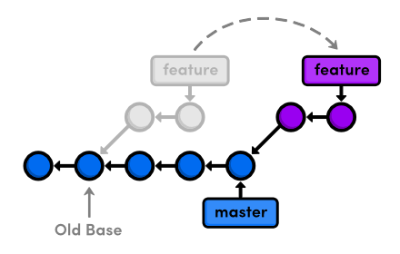
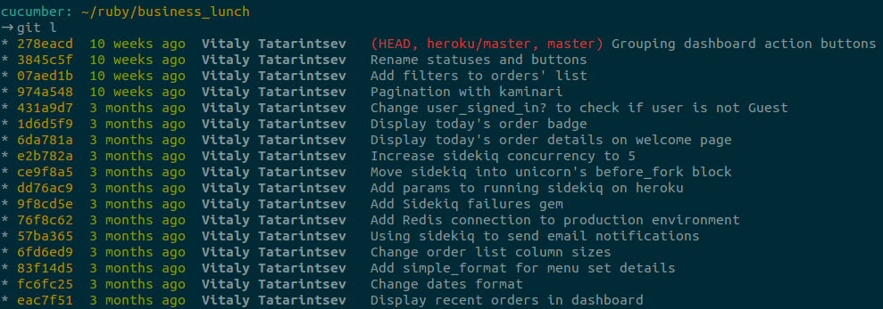

# Git: Best Practices

## Foreword

Many of us are using git in our day-to-day work. I've noticed that some of you (or may be many of you) are using only a few few features of it e.g. `add`, `commit`, `push`, `pull`.
There might be different reasons for that; you might not know anything better or are overwhelmed by their complexity.
Commands `amend` and `rebase` might seem a nightmare for you.
Now I will try to fix that.

## Why history is important

Git history is like the table of contents of a book.
It helps other people understand the purpose of each commit.
What's why your logs should be well named and follow a clear description.

## Some Commits best practices

  * Commit should contain related changes. Fixing two different bugs should produce two separate commits.
    Small commits make it easier to understand for other team members.

  * Commit often. It will allow you to commit only related changes.

  * Don't commit work half-done. This means you should not commit an unfinished feature at the end of working day.
    This also does not mean you should commit a huge complex feature in one commit. Just split it into small chuncks.

  * Use branch per feature. That will allows you to switch between tasks.

## Read before commit

There is a good practice to read your emails and messages before you send them.
That works and with `git diff` as well. So check your diffs before commit.

Simply use `git diff` command for unstaged files and `git diff --cached` for the staged ones.
(staged files are the files what just have added using `git add` command)

I usually find some stuff to fix like extra empty line, todo comment or typos.

## How to write good commit message

Never use -m (--message) flag to git commit.
It invites you to set short unreadable commit messages.
`git commit` will open your default editor where you could write a more useful commit message.

There is a terrific note from Tim Pope about writing commit messages.

Long story short.

Your commit title should be a short, capitalized sentence with 50 or less characters followed by a blank line.
Then a more detailed description of changes goes wrapped in about to 72 characters.

Write your commit messages in an imperative fashion: Use "fix", "change", "add" instead of "fixed", "changed", "added".
This convention matches up with commit messages generated by `git merge` and `git revert`.

## Add changes interactively

You're probably familiar with adding files into staging area using the `add` command.
Sometimes you might make changes that should belong to different commits.
As we said, we don't want our commits to looks like 'Fix A and B'.

So here `add -p <filename>` (`add --patch`) comes to help.
Interactive adding will ask to perform some action for each hunk.
These actions are:

    y - stage this hunk
    n - do not stage this hunk
    q - quit; do not stage this hunk nor any of the remaining ones
    a - stage this hunk and all later hunks in the file
    d - do not stage this hunk nor any of the later hunks in the file
    g - select a hunk to go to
    / - search for a hunk matching the given regex
    j - leave this hunk undecided, see next undecided hunk
    J - leave this hunk undecided, see next hunk
    k - leave this hunk undecided, see previous undecided hunk
    K - leave this hunk undecided, see previous hunk
    s - split the current hunk into smaller hunks
    e - manually edit the current hunk
    ? - print help

## What is fast forward

When you're trying to merge two branches and that merge can be made without conflicts git just
points current branch to the last commit of target branch - this is called "fast forward".
We could avoid using fast forward for merge and even set is as default behavior for merge.

## Merge with --no-ff

The --no-ff flag ensures there will be a merge commit, even if git could do a fast forward merge.
That picture shows the difference between merges with and without fast forward.


## What is rebase?

From git help:

  "git-rebase - Forward-port local commits to the updated upstream head"

Clear enough?

NO!

Simply put: Rebase is the command to rewrite history in some ways.
These ways could are: moving your commits on top of another branch, squash, split, amend.

Simpliest use:

From your branch `git rebase master`.
Saves all commits made in current branch to temporary area.
Resets your branch to master state then applies commits one by one from temporary area.
Complete result would looks like:




Example of `git rebase --interactive (or just -i) commits..range` will start interactive rebasing.
It will opens default editor with following result:

    pick 1fc6c95 Patch A
    pick 6b2481b Patch B
    pick dd1475d something I want to split
    pick c619268 A fix for Patch B
    pick fa39187 something to add to patch A
    pick 4ca2acc i cant' typ goods
    pick 7b36971 something to move before patch B

    # Rebase 41a72e6..7b36971 onto 41a72e6
    #
    # Commands:
    #  p, pick = use commit
    #  r, reword = use commit, but edit the commit message
    #  e, edit = use commit, but stop for amending
    #  s, squash = use commit, but meld into previous commit
    #  f, fixup = like "squash", but discard this commit's log message
    #  x, exec = run command (the rest of the line) using shell
    #
    # If you remove a line here THAT COMMIT WILL BE LOST.
    # However, if you remove everything, the rebase will be aborted.

But. Do not rebase published commits. Rebase changes commits and these commits will differ from previous ones.
People who've got these commits before will face some issues after pulling your changes.
As exception I accept rebasing for feature branches because I will throw it out after merge into the development branch.

## git pull --rebase

Pulling changes from remote location by default tries to merge changes into you current branch.
It uses fast forward if it's possible but creates merge commit when facing conflicts in changes.
In order to avoid extra merge commit we can use git pull with --rebase params.
That will move our non published commits on top of the history tree.

## My Git workflow

  * Create new branch for every main feature using git checkout -b <feature-branch>
  * Commit your code in small indepent pieces.
  * If you forgot something for last commit use `git --amend`
  * If you forgot something for recent commits then commit is as fix and use `rebase -i` to change commits order and squash them.
  * Use git rebase <main-branch> (it might be master or develop) from your <feature-branch> to move all your commits on top.
  * Use git merge --no-ff <feature-branch> from <main-branch>

## Aliases

To avoid wasting time you could describe aliases to most used git commands. There is mine:

```
# ~/.gitconfig

[alias]
  st = status
  co = checkout
  aa = add --all
  ff = flow feature
  l = !~/.githelpers
  dc = diff --cached
  rc = rebase --continue
```

As you could notice I'm using file name as `l` alias.
This is how you can get the result of an external file as your command.

This is my script (To be honest it's 'borrowed' from another guy) that formats logs:

```
#!/bin/bash

HASH="%C(yellow)%h%C(reset)"
RELATIVE_TIME="%C(green)%ar%C(reset)"
AUTHOR="%C(bold blue)%an%C(reset)"
REFS="%C(red)%d%C(reset)"
SUBJECT="%s"

FORMAT="$HASH{$RELATIVE_TIME{$AUTHOR{$REFS $SUBJECT"

git log --graph --pretty="tformat:$FORMAT" $* | column -t -s '{' | less -FXRS
```

Here is how it looks like in terminal window.



## Git Bisect

One of my favorite features that helped me many times. I also enjoy asking about it on job inverviews.

Lets imagine a situation where you have realized that something had broken and you don't know when.
But you know that 15 commits ago it used to work. How to find the guilty commit?
That's when git bisect helps.

git bisect uses binary search to find broken commit.

How to use
```
git bisect start
git bisect bad            # Mark current version as bad
git bisect good v1.2.3    # Mark good commit
```

git will checkout you between these commits where you will be able to check your current state.
Then mark commit as good/bad. You should keep going until you have found the bad commit.
Check the differences using git show. Understand the problem. Use git reset to finish.

Note:
When your commits aren't atomic e.g. failing specs and its fixes are in different commits, you will probably be confused that bisect provides the commit with the failing specs.

## Afterword

Git is a powerful tool. We are all using it on every day basis. Thus it's a good idea to master it.
Try to use these pieces of advice in your everyday work. I hope you will like it.


## Links

  * http://tbaggery.com/2008/04/19/a-note-about-git-commit-messages.html
  * http://mislav.uniqpath.com/2013/02/merge-vs-rebase/
  * https://www.atlassian.com/git/tutorials/rewriting-history
  * http://code.tutsplus.com/tutorials/git-tips-from-the-pros--net-29799
  * http://codeinthehole.com/writing/pull-requests-and-other-good-practices-for-teams-using-github/
