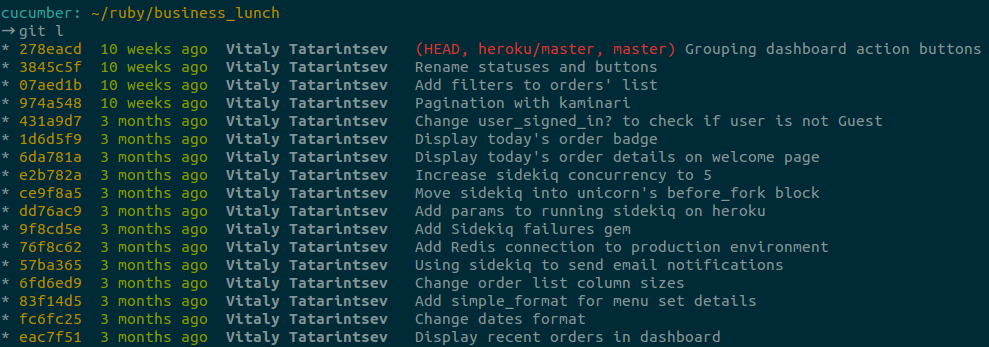

# Git: Лучшие Практики

## Вступление

Многие из нас используют git в своей повседневной работе. Я обратил внимание, что некоторые из Вас (а, может быть, и многие) используют только несколько возможностей git, такие как add, commit, push и pull.
Это может быть по нескольким причинам. Вы можете не знать дополнительных возможностей или вы напуганы их сложностью.
А такие команды, как amend и rebase - для вас, вообще, ночной кошмар.
Сейчас попробуем разобраться в этом всем.

## Почему история коммитов важна

История коммитов - это как оглавление в книге.
Это помогает вашим коллегам понимать содержимое и цель каждого коммита.
Обнаружив некоторую ошибку или непонятную часть кода, каждый пользователь может выснить, в каком именно коммите были сделаны те или иные изменения, а правильное описание сильно поможет ему в этом.

## Полезные советы

  * Коммит должен содержать только те изменения, которые к нему относятся. Исправляя две разные ошибки, вы должны разделить их в отдельные коммиты. Небольшие коммиты проще понять всем остальным.
  * Частые коммиты. Это поможет Вам создавать небольшие коммиты с одной определенной задачей.
  * Не стоит коммитить незаконченный функционал. Это значит - не нужно создавать коммит в конце рабочего дня лишь для того, чтобы "не потерять" свои изменения. Гит - не система для бэкапов. И это вовсе не значит, что нужно коммитить всю задачу (feature) целиком. Нужно просто разбить ее на подзадачи.
  * Используйте отдельную ветку для каждой задачи. Это поможет переключаться вам между задачами.

## Перечитывайте перед тем, как коммитить.

Перечитывать написанное всегда полезно, будь то письмо, сообщение или сочинение. Это помогает выявить некоторые ошибки и опечатки.
То же самое при работе с git.

git diff в этом случае отобразит разницу в измененных файлах, а git diff -- cached в файлах, уже добавленных командой git add.
Просматривая свои изменения, я обычно нахожу несколько вещей, которые можно исправить: лишняя пустая строка, комментарий или опечатки.

## Как составить хорошее описание коммита.

Не используйте параметр -m (--message), когда коммитите ваши изменения. Это подталкивает Вас написать короткое и, зачастую, мало полезное описание коммита.
git commit же (без параметров) запустит ваш редактор по умолчанию, где можно более удобно редактировать описание.

Есть замечательная заметка Тима Поупа о том, какие должны быть описания коммитов.

Короче говоря:

Заголовок коммита должен быть коротким описанием, начинающийся с заглавной буквы, не более 50 символов.
Затем следует более детальное описание, отделенное от заголовка пустой строкой. Границы данного описания должны быть в пределах 72 символов.

Пишите Ваши сообщения в повелительном наклонении: Использя "fix", "change", "add" вместо "fixed", "changed", "added".
Это соглашение совпадает с сообщениями, генерируемыми командами git merge и git revert.

## Используйте возможность добавлять изменения по шагам.

Вероятнее всего, вы знакомы с добавлением изменений в подготовительную область, используя комманду git add.
Иногда Ваши изменения могут принадлежать разным коммитам.
Как мы говорили ранее, мы не хотим видеть коммитов подобных: "Fix A and B".

В такие моменты к нам на помощь приходит атрибут `git add -p <filename>` (`add --patch`).
Данная команда позволяет добавлять наши изменения по шагам, останавливаясь на каждом кусочке и предлагая следующие действия на выбор:

    y - stage this hunk
    n - do not stage this hunk
    q - quit; do not stage this hunk nor any of the remaining ones
    a - stage this hunk and all later hunks in the file
    d - do not stage this hunk nor any of the later hunks in the file
    g - select a hunk to go to
    / - search for a hunk matching the given regex
    j - leave this hunk undecided, see next undecided hunk
    J - leave this hunk undecided, see next hunk
    k - leave this hunk undecided, see previous undecided hunk
    K - leave this hunk undecided, see previous hunk
    s - split the current hunk into smaller hunks
    e - manually edit the current hunk
    ? - print help


## Что такое fast forward

Когда вы пытаетесь слить одну ветку в другую и это слияние не вызывает никаких конфликтов в измененном коде, git просто меняет текущий указатель на последний коммит целевой ветки. Этот процесс и называется fast forward.

## Слияние, используя --no-ff

Параметр --no-ff позволят создавать дополнительный коммит при слиянии веток даже там, где слияние может быть произведено через fast forward.
Разница между слиянием с fast forward и без представлена на рис:


## git rebase

Что такое rebase?

Из справки о git:

  "git-rebase - Forward-port local commits to the updated upstream head"

Достаточно понятное описание?

Конечно, нет.

Rebase -- это команда, которая позволяет переписывать историю некоторыми методами.
Такими, как: поренос коммитов в начало другой ветки, слияние коммитов и их изменение.

Самое простое применение:

Находясь в вашей ветке `git rebase master`.
Сохраняет ваши коммиты во временной области.
Сбрасывает вашу ветку до состояния master, потом применяет по одному Ваши коммиты из временной области.
Конечный результат выглядит следующим образом:


Командой `git rebase --interactive (-i) commits..range` можно провести интерактивный rebase.
Данная команда запустит наш редактор со следущим содержанием:

    pick 1fc6c95 Patch A
    pick 6b2481b Patch B
    pick dd1475d something I want to split
    pick c619268 A fix for Patch B
    pick fa39187 something to add to patch A
    pick 4ca2acc i cant' typ goods
    pick 7b36971 something to move before patch B

    # Rebase 41a72e6..7b36971 onto 41a72e6
    #
    # Commands:
    #  p, pick = use commit
    #  r, reword = use commit, but edit the commit message
    #  e, edit = use commit, but stop for amending
    #  s, squash = use commit, but meld into previous commit
    #  f, fixup = like "squash", but discard this commit's log message
    #  x, exec = run command (the rest of the line) using shell
    #
    # If you remove a line here THAT COMMIT WILL BE LOST.
    # However, if you remove everything, the rebase will be aborted.

Но не рекомендуется применять rebase к уже опубликованным коммитам. Rebase изменяет затронутые коммиты, даже если эти изменения не очевидны. Это значит, что люди, которые уже стянули эти коммиты ранее, столкнутся с различными сложностями, когда попытаются стянуть новые изменения.
В качестве исключения, я допускаю rebase в отдельной ветке (для одной подзадачи), т.к. эта ветка в дальнейшем потом все равно будет удалена после слияния ее в основную ветку.

## git pull --rebase

git pull, по умолчанию, пытается слить изменения (используя merge) в текущую ветку.
Как мы уже знаем, merge испольует fast forward для слияния там, где это возможно, но создает дополнительный коммит при возникновении конфликтов.
Для того, чтобы этого избежать, мы можем использовать git pull --rebase.
Эта команда сдвинет наши неопубликованные коммиты вверх дерева истории.

## Как выглядит (мой) рабочий процесс.

  * Для каждой основной задачи создается отдельная ветка, используя git checkout -b <имя-ветки>
  * Создаются коммиты для каждой небольшой и независимой подзадачи
  * Если что-то забыли, можно подправить последний коммит git --amend
  * Если изменения нужно провести в нескольких коммитах, поменять их местами или объединить, используем git rebase -i
  * Перед слиянием текущей ветки в основную производим git rebase <имя-основной-ветки>
  * Сливаем ветки, используя git merge --no-ff <имя-ветки>, находясь при этом в основной ветке

## Aliases

Для того, чтобы сократить время набора различных комманд, можно использовать их сокращенные псевдонимы.

```
# ~/.gitconfig

[alias]
  st = status
  co = checkout
  aa = add --all
  ff = flow feature
  l = !~/.githelpers
  dc = diff --cached
  rc = rebase --continue
```

Можно заметить, что мой `l` псевдоним использует отличную от других структуру. Таким образом, можно использовать результат выполнения внешнего файла.

Вот пример моего скрипта для вывода дерева истории. (По правде говоря, я позаимствовал его у одного разработчика)

```
#!/bin/bash

HASH="%C(yellow)%h%C(reset)"
RELATIVE_TIME="%C(green)%ar%C(reset)"
AUTHOR="%C(bold blue)%an%C(reset)"
REFS="%C(red)%d%C(reset)"
SUBJECT="%s"

FORMAT="$HASH{$RELATIVE_TIME{$AUTHOR{$REFS $SUBJECT"

git log --graph --pretty="tformat:$FORMAT" $* | column -t -s '{' | less -FXRS
```

Вот как он выглядит в окне терминала.



## git bisect

Одна из моих любимых возможностей, которая ни раз меня выручала. Также мне нравится задавать этот вопрос на интервью.

Представим следующую ситуацию. Мы заметили, что у нас сломался какой-то функционал, мы не заметили, когда это случилось, но точно знаем, в какой из версий этот функционал работал. Как узнать, в каком из коммитов это произошло?

git bisect использует двоичный поиск для того, чтобы найти этот самый коммит.

```
git bisect start
git bisect bad            # Помечаем текущую версию, как сломанную
git bisect good v1.2.3    # Почаем коммит с работающей версией
```

git будет переключать нам по одному коммиту, где мы будем прогонять тесты или каким-либо образом проверять, рабочий коммит или нет.
В зависимоти от результата, мы также отмечаем текущий коммит, как сломанный или нет, до тех пор, пока не найдем виновника.
Далее коммандой git show мы можем просмотреть текущий коммит и выяснить причину.
git reset позволяет завершить процесс поиска.

В данном случае вы можете столкнуться со следующей сложностью. Если ваши коммиты не атомарны, например, в одном коммите содержатся проваленные тесты, а в следующем -- их реализация, то git bisect может привести вас к первому коммиту, что, при запуске тестов, введет вас в заблуждение. Вы не будете понимать, что именно у вас сломалось. Это одна из причин, почему я не рекомендую разделять таким образом тесты и реализацию в разные коммиты.

## Заключение

Git -- мощный инструмент. Т.к мы используем его каждый день, то овладеть им лучше будет довольно неплохой затеей.
Попробуйте использовать эти техники в своей работе.
Надеюсь, это принесет вам удовольствие от вашей работы.

## Дополнительные материалы


  * http://tbaggery.com/2008/04/19/a-note-about-git-commit-messages.html
  * http://mislav.uniqpath.com/2013/02/merge-vs-rebase/
  * https://www.atlassian.com/git/tutorials/rewriting-history
  * http://code.tutsplus.com/tutorials/git-tips-from-the-pros--net-29799
  * http://codeinthehole.com/writing/pull-requests-and-other-good-practices-for-teams-using-github/
